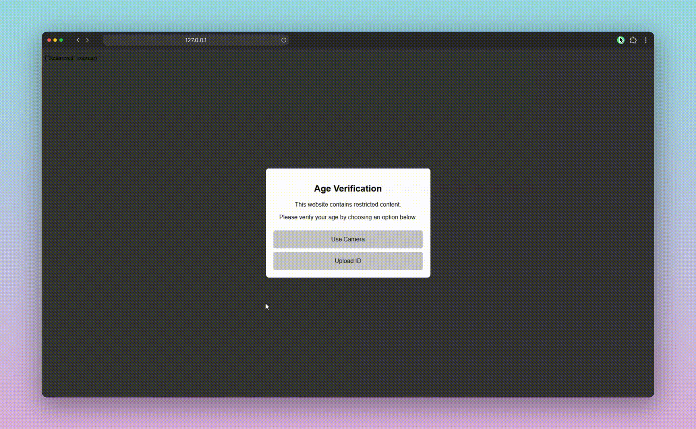

# Fake Age Verification

Have you noticed an increase in websites asking you for personal information in order to verify you are 18+? YouTube, Discord, Google, Spotify, Xbox, Roblox, X...

Age verification is in the horizon to become a requirement for social media, or any platform with a social aspect (chat, comment sections...) to operate.

This is a simple JS script that simulates age verification via facial age estimation technology or ID image upload. No data is actually sent anywhere, and no actual age verification is performed.

# Features
- A simple to use popup
- Face detection (optional): A face has to be in frame to be able to take the picture, this is NOT age verification.
- ID Image upload: This will not check if it is a valid ID or not
- Fake processing time
- A cookie to remember if the user is verified

# Demonstration
(The following picture was generated with https://thispersondoesnotexist.com)

Face detection:


ID upload:


# How to use
Simply paste one of these two code snippets in your \<head>.

**With face detection:** Uses [face-api.js](https://github.com/justadudewhohacks/face-api.js)
```html
<script defer src="https://unpkg.com/face-api.js@0.22.2/dist/face-api.min.js"></script>
<script src="https://github.com/zzniki/fake-age-verification/releases/download/v1.0/age-verification.js"></script>
```

**Without face detection:**
```html
<script src="https://github.com/zzniki/fake-age-verification/releases/download/v1.0/age-verification.js"></script>
```

# The story

**Anonymity is an essential part of the internet, not only are laws progressing toward making identification a requirement, creating a security risk, they are also being enforced without providing any resources for compliance. All the costs of verification services will have to be paid by the service provider, thus rendering the creation of small indie websites run by one person or a handful of people inviable and unprofitable.**

As said in [this reddit discussion](https://www.reddit.com/r/webdev/comments/1mhiw6c/theyre_destroying_the_internet_in_real_time_there):

"Every country seems to be passing the same law, all at once. And with a near 100% majority in their congress. This is clearly coordinated.

The fines for non-compliance are astronomical, like $20 million dollars, with no exceptions for small websites. Punishment for non-compliance includes jailing the owners of websites.

The age verification APIs are not free. It makes running a website significantly more expensive than the cost of a VPS.

"Social Media" is defined so broadly that any forum or even a comment section is "social media" and requires age verification.

"Adult Content" is defined so broadly it includes thoughts and opinions that have nothing to do with sexuality. Talking about world politics is "adult content". Talking about economic conditions is "adult content".

No one will be able to operate a website anymore unless they have a legal team, criminal defense indemnity for the owners, AI bots doing overzealous moderation, and millions of dollars for all of the compliance tools they need to run, not to mention the insurance they would need to carry to cover the inevitable data breach when the verification provider leaks everyone's faces and driver's licenses.

This will end all independent websites and online communities. This will end most hosting companies. Only fortune 500's will have websites. This will reduce web developer jobs to only a few mega corps."

## Current laws
- [Age verification laws are rapidly spreading around the United States](https://action.freespeechcoalition.com/age-verification-bills). 
- [The UK has already passed the Online Safety Act, requiring AV in sites with adult content](https://www.gov.uk/government/publications/online-safety-act-explainer/online-safety-act-explainer)
- [The European Union is working on their own age verification app](https://digital-strategy.ec.europa.eu/en/policies/eu-age-verification)
- [Australia implemented the eSafety AV Code](https://www.abc.net.au/news/2025-07-11/age-verification-search-engines/105516256)

You can find more information on the current global age verification laws on [freespeechcoalition.com](https://action.freespeechcoalition.com/age-verification-resources/global-age-verification-policies) and the [AVPA](https://avpassociation.com/map).

## Articles opposing them
Here are some articles opposing age verification by the Electronic Frontier Foundation:
- [Protecting Minors Online Must Not Come at the Cost of Privacy and Free Expression](https://www.eff.org/deeplinks/2025/06/protecting-minors-online-must-not-come-cost-privacy-and-free-expression)
- [Keeping People Safe Online – Fundamental Rights Protective Alternatives to Age Checks](https://www.eff.org/deeplinks/2025/05/keeping-people-safe-online-fundamental-rights-protective-alternatives-age-checks)
- [Just Banning Minors From Social Media Is Not Protecting Them](https://www.eff.org/deeplinks/2025/07/just-banning-minors-social-media-not-protecting-them)
- [Zero Knowledge Proofs Alone Are Not a Digital ID Solution to Protecting User Privacy](https://www.eff.org/deeplinks/2025/07/zero-knowledge-proofs-alone-are-not-digital-id-solution-protecting-user-privacy)
- [Despite Supreme Court Setback, EFF Fights On Against Online Age Mandates](https://www.eff.org/deeplinks/2025/07/despite-supreme-court-setback-eff-fights-against-online-age-mandates)

# Disclaimer
This is obviously satire and for demonstration purposes, using this script will not make your website comply with any laws regarding age verification, it does not actually perform any checks.

I AM NOT RESPONSIBLE FOR THE USE OR MISUSE OF THIS PROJECT, NOR ANY CONTRIBUTORS.

IN NO EVENT SHALL THE
AUTHORS OR COPYRIGHT HOLDERS BE LIABLE FOR ANY CLAIM, DAMAGES OR OTHER
LIABILITY, WHETHER IN AN ACTION OF CONTRACT, TORT OR OTHERWISE, ARISING FROM,
OUT OF OR IN CONNECTION WITH THE SOFTWARE OR THE USE OR OTHER DEALINGS IN THE
SOFTWARE.
